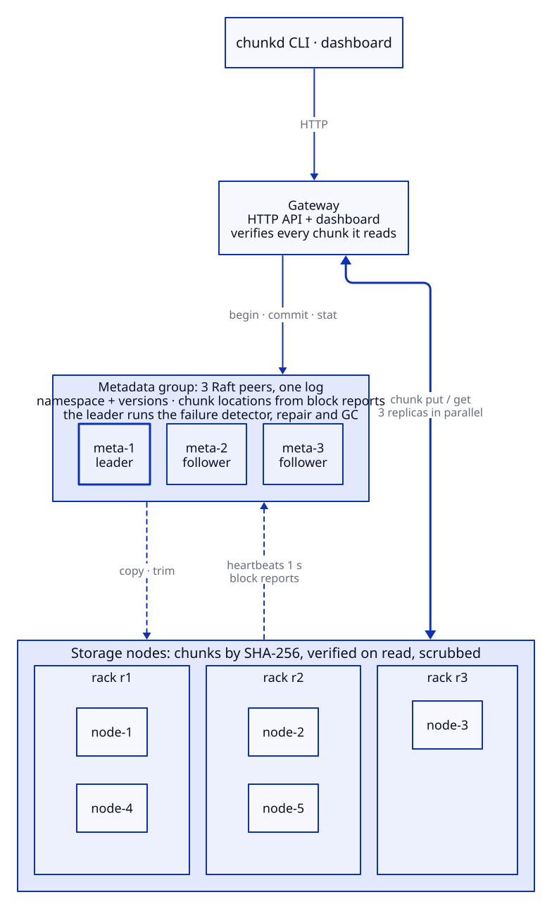

# chunkd

A fault-tolerant distributed file store in Go, in the style of GFS and HDFS.

[](https://github.com/insanityatpeak/chunkd/actions/workflows/ci.yml)
[](go.mod)
[](LICENSE)
[](https://insanityatpeak.github.io/chunkd/)


**[Try it in your browser →](https://insanityatpeak.github.io/chunkd/)** A simulated cluster running the same core code, compiled to WebAssembly. Kill nodes, rot a disk, partition the network, and watch it recover. Nothing to install.

chunkd splits files into 4 MiB chunks named by their SHA-256 and keeps three copies of each, on nodes in different racks. A metadata server tracks versions and where every copy lives. It is built to stay correct while things break. A node can crash, freeze, turn slow or come back with an empty disk, and a disk can silently rot bits. Throughout, acknowledged data stays readable, every read is verified end to end, and lost copies are rebuilt within a stated time bound, at a capped rate, without copying anything for a node that only rebooted. Every claim below is a test that runs in CI: 500 seeded chaos schedules on every push in a deterministic simulator that replays any failure from its seed, plus a real-mode suite that kills, freezes and corrupts Docker containers.

## Architecture



The metadata server is never on the data path. Chunk locations are not stored: nodes report what they hold, as in GFS and HDFS. Design decisions are in [docs/adr](docs/adr), the protocol with sequence diagrams in [docs/design.md](docs/design.md).

## Quickstart

```
git clone https://github.com/insanityatpeak/chunkd && cd chunkd
docker compose up -d --build --wait
```

Open **http://localhost:8080**: the same dashboard, connected to the real cluster (1 metadata server, 5 storage nodes on 3 racks, a gateway). On a small machine, `docker compose --profile small up -d --build --wait` runs 1 metadata server and 3 nodes.

From a Go toolchain:

```
go run ./cmd/chunkd put ./photo.jpg /photos/photo.jpg
go run ./cmd/chunkd stat /photos/photo.jpg        # version, SHA-256, replicas per chunk
go run ./cmd/chunkd get /photos/photo.jpg ./copy.jpg
go run ./cmd/chunkd cluster status                # detector state, replication, repair
```

## Chaos demo

```
docker compose run --rm demo
```

Uploads 20 MiB, kills the node holding the most copies, and prints the failure detector's and the repair scheduler's timeline. Then it downloads with the node still down, checks the SHA-256, restarts the node, and watches the extra copies get trimmed. The demo container kills and starts containers through the Docker socket, which gives it root-equivalent access to Docker on your machine: it is opt-in and local. `go run ./tools/task demo` does the same from a clone.

More ways to break it:

```
go run ./tools/task chaos --seeds=500                  # 500 random fault schedules in the simulator
go run ./tools/task chaos --seed=63 -v                 # replay one, with its schedule and logs
go run ./tools/task chaos --mode=real --short          # kill, blip, rot and freeze real containers
docker compose exec node-2 chunkd debug corrupt -n 3   # rot 3 chunk files; the scrubber finds them
```

Shared dashboard links replay exactly: [kill a node](https://insanityatpeak.github.io/chunkd/?seed=7&scenario=kill-node&speed=10), [silent bit rot](https://insanityatpeak.github.io/chunkd/?seed=7&scenario=corrupt-chunk&speed=10), [lose a rack](https://insanityatpeak.github.io/chunkd/?seed=7&scenario=rack-loss&speed=10), [slow node](https://insanityatpeak.github.io/chunkd/?seed=7&scenario=slow-node&speed=10).

## What's proven

| Claim | Test | CI job |
|---|---|---|
| Round trips from 0 B to 37 MiB, with chunk and file hashes checked | `e2e.TestRoundTrip` (sim and real processes) | go |
| An upload is invisible until it commits, and commits only with 2 reported copies | `TestUncommittedInvisible`, `TestCommitRequiresMinReplicas` | go |
| Commit and delete are safe to repeat when responses are lost or duplicated | `TestCommitAndDeleteAreIdempotent`, `TestUploadsUnderMessageLoss` | go |
| A crash mid-write never loses an acknowledged metadata op | `TestTornTailRecovers`, `TestCorruptionBeforeTailIsAnError` | go |
| A dead node's chunks are back at 3 copies within the stated bound | `TestKillNodeRestoresRF` (sim), `kill-node-restores-rf` (containers) | go, compose |
| A node that only reboots costs zero copies | `TestTransientBlipNoRepair`, `transient-blip-no-repair` | go, compose |
| Repair never exceeds its concurrency limits and byte rate | `TestRepairThrottle` | go |
| A slow replica does not slow reads | `TestSlowNodeHedgedRead` (hedged p99 under 200 ms against 4–10 s) | go |
| A corrupt copy is caught on read, quarantined and replaced | `TestCorruptChunkDetectedOnRead`, `corrupt-replicas` | go, compose |
| Rot that nobody reads is found within one scrub pass | `TestScrubberFindsCorruption` | go |
| When every copy is bad, the read fails loudly instead of returning bad bytes | `TestAllReplicasCorrupt` | go |
| Block reports reordered by the network never drop or resurrect a copy | `TestClusterReportOrdering` | go |
| Under random faults, acknowledged data stays readable, RF returns within the bound, rot is found, and no read returns bytes never written | 500 chaos seeds per push (20,000 on demand) | go |
| A seed replays the same run, in Go and in the browser | `TestSameSeedSameTrace`, `TestScenarioGolden` + Playwright replay | go, web |
| The demo runs with only Docker installed | `docker compose run --rm demo` | compose |

Bugs these tests caught, with root causes and fixes: [docs/bugs-found.md](docs/bugs-found.md).

## Known limitations

| Limitation | Why it is acceptable now | Plan |
|---|---|---|
| One metadata server; if it is down, nothing is readable or writable | Data on nodes is untouched; the server recovers from its WAL and asks nodes for locations | Raft replication (Phase 5) |
| Abandoned pending uploads and deleted files' chunks are never reclaimed | Refcounts are recorded; nothing reads them yet | GC (Phase 4) |
| No authentication; plaintext gRPC and HTTP | Runs on a private Docker network | mTLS in the transport |
| Upload size must be known up front | Placement is computed per chunk at `BeginUpload` | HDFS-style `addBlock` per chunk |
| Placement ignores existing copies of a chunk; identical chunks in one upload can get extra replicas | Correct, just wasteful | Dedup-aware placement (Phase 4) |
| With unbalanced racks, the smallest rack holds a replica of every chunk | Rack spread deliberately outranks load (ADR-0008) | Balanced racks, or capacity-weighted placement |
| A lost incremental block report delays a commit until the next full report (up to 30 s) | The client retries commit for 45 s | Acknowledged incremental reports |
| Every copy of a chunk rotting within one scrub window loses it; the read fails with `corrupt` | Needs three independent failures inside one pass interval plus repair time (about q³; ADR-0013) | Shorter passes or erasure coding with parity checks |
| Correlated corruption (a firmware or driver bug on several disks at once) defeats the independence the math assumes | Rack spread puts copies on different hardware; nothing more | Mixed disk models and firmware per replica set, as large operators do |
| Corruption in the client's memory before it hashes the data is stored as valid | The hash is computed from what the client holds | End-to-end checksums from the data's source (the application) |
| Quarantined files are never removed | Kept for forensics; small next to live data | GC ages them out (Phase 4) |
| The scrubber runs on the node's event loop, one chunk per step | A 4 MiB hash takes a few ms, far below the 3 s suspect timeout | A scanner thread per volume, as HDFS does |
| Client re-check hints are not rate-limited | Each costs the node one re-read, and only the node's check removes a copy | Per-client hint budget |
| The metadata WAL is CRC-checked but a corrupt entry cannot be repaired | Detected at startup, the server refuses to start | Replicated log (Raft, Phase 5) |
| Directory fsync is a no-op on Windows | Production target is Linux; NTFS journals renames | None |
| Real-mode chaos has no message-level faults (loss, duplication, delay) | The sim covers them in 500 seeds per push; real mode covers process faults (kill, pause, wipe) | `tc netem` in each container, which needs `NET_ADMIN` |
| Repair targets ignore the surviving replicas' racks; a repaired chunk can end with two copies in one rack | Upload placement still spreads racks, and trims keep spread when a node returns | Rack-aware target choice, as HDFS's `BlockPlacementPolicy` does with existing replicas as input |
| A repair copy's store write runs on the node's event loop | One chunk is at most 4 MiB, a few ms of disk | Move the write to the concurrent chunk path, as client writes already are |
| Placement does not avoid slow nodes; only reads route around them | Hedged reads bound the read cost; writes need 2 of 3 | Feed client latency reports into placement (HDFS slow-node detection) |
| A trim can race a client write that dedups against the trimmed chunk: the commit may count a copy that is deleted a moment later | The chunk keeps at least RF confirmed copies before the trim, and repair tops it up on the next report or scan | Pin chunks of pending uploads against trims (Phase 4 GC) |
| Dedup'd writes can leave chunks over-replicated until the next block report | Correct, just extra copies, trimmed on the next report | Dedup-aware placement (Phase 4) |

## Project layout

| Path | Contents |
|---|---|
| `internal/core/` | Deterministic logic: chunking, placement, metadata state machine, failure detector, repair scheduler, scrubber, storage node. Imports no network, disk, clock or randomness. |
| `internal/iface/` | The seams: transport, clock, block store, metadata log, randomness, with conformance suites every implementation must pass |
| `internal/sim/` | Fake clock, seeded network with loss, duplication, delay, partitions and crashes, in-memory stores, the cluster harness |
| `internal/real/` | gRPC transport, disk block store, WAL + bbolt metadata log, HTTP gateway, process runtime |
| `internal/chaos/` | Seeded fault schedules with invariant checks, in the sim and against docker compose |
| `internal/client/` | The client library the CLI, gateway, tests and browser all use |
| `cmd/` | `chunkd` (CLI), `chunkd-meta`, `chunkd-node`, `chunkd-gateway`, `chunkd-demo`, `chunkd-chaos`, `chunkd-wasm` |
| `web/` | Preact + TypeScript dashboard, one UI for the simulation and the real cluster |
| `deploy/` | Dockerfile, compose file, the GIF's `vhs` tape |
| `docs/` | ADRs, design, status, bugs found |

Every command runs through `go run ./tools/task <name>`, the same on Windows, Linux and CI; see [CONTRIBUTING.md](CONTRIBUTING.md).

## Roadmap

- [x] Chunked, replicated upload and download with end-to-end verification
- [x] Failure detection, throttled re-replication, hedged reads
- [x] Integrity: verify on read, scrubbing, quarantine, corruption repair
- [ ] High-availability metadata with Raft (replicated log, leader election)
- [ ] Deduplication-aware placement and garbage collection
- [ ] Rebalancing when nodes join or leave
- [ ] Erasure coding for cold data

## License

MIT
