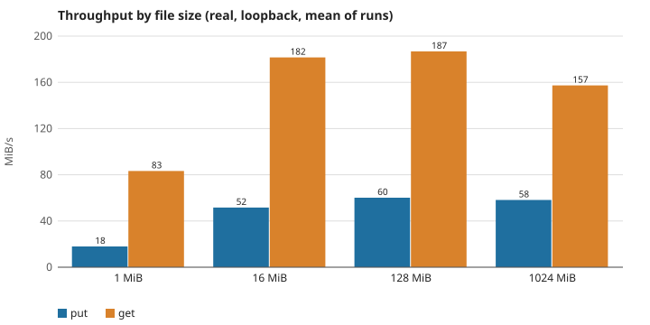
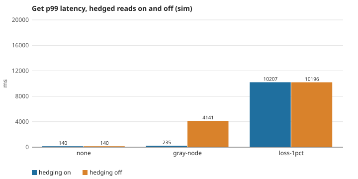
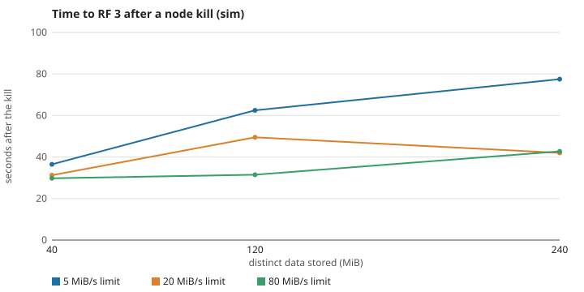
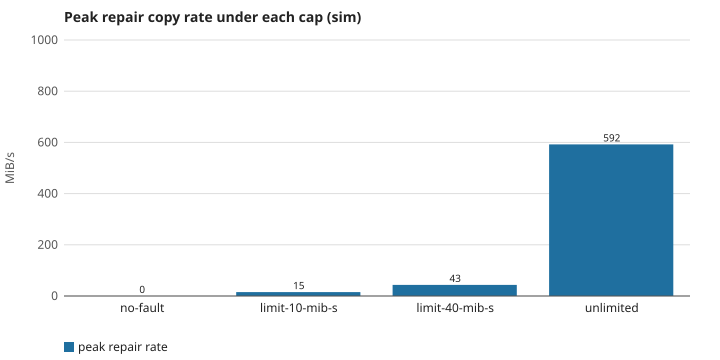
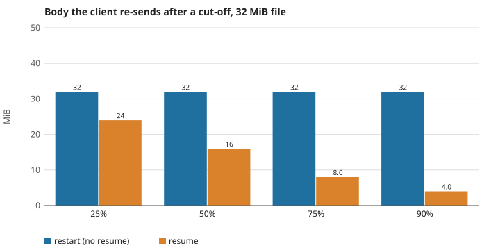
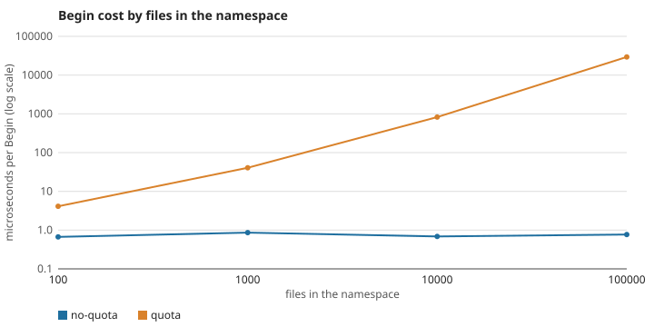

# Results

Generated by `go run ./tools/task bench` from the CSVs in `data/`; do not edit by hand.

Real-tier hardware: AMD Ryzen 7 7840HS w/ Radeon 780M Graphics; 16 logical CPUs; 15 GiB RAM; go1.27.0 windows/amd64

Sim-tier numbers (repair, latency, resume) are in simulated time and identical on any machine for the same seed. Real-tier numbers (throughput, real latency) are wall-clock on one machine, one client, loopback, and the OS page cache; see [README.md](README.md) for what they do and do not show.

## Throughput by file size (real, RF 3, 5 nodes)

Put and get of one file, sequentially, 3 runs per size (1 for 1 GiB). Every chunk is checked against its hash on read.

| size_mib | run | put_s | get_s | put_mib_s | get_mib_s |
|---|---|---|---|---|---|
| 1 | 1 | 0.113 | 0.021 | 8.828 | 47.477 |
| 1 | 2 | 0.052 | 0.010 | 19.253 | 95.702 |
| 1 | 3 | 0.039 | 0.009 | 25.718 | 106.572 |
| 16 | 1 | 0.314 | 0.095 | 50.956 | 168.035 |
| 16 | 2 | 0.324 | 0.088 | 49.314 | 181.536 |
| 16 | 3 | 0.293 | 0.082 | 54.670 | 195.061 |
| 128 | 1 | 2.154 | 0.701 | 59.423 | 182.706 |
| 128 | 2 | 2.068 | 0.678 | 61.906 | 188.683 |
| 128 | 3 | 2.162 | 0.677 | 59.206 | 189.004 |
| 1024 | 1 | 17.590 | 6.509 | 58.215 | 157.331 |

Raw: [data/real-throughput.csv](data/real-throughput.csv)

## Latency, real (256 KiB files, 1000 sequential operations)

One client, no faults. The unit is milliseconds.

| op | samples | p50_ms | p95_ms | p99_ms | max_ms |
|---|---|---|---|---|---|
| put | 1000 | 42.211 | 60.251 | 328.321 | 481.962 |
| get | 1000 | 2.575 | 4.073 | 11.811 | 23.668 |
| stat | 1000 | 0.522 | 0.618 | 13.000 | 25.092 |

Raw: [data/real-latency.csv](data/real-latency.csv)

## Latency under a gray node and loss (sim)

40 files of 1 MiB read 3 times, 30 puts, 3 seeds pooled, a new client for every operation (a long-lived client learns the slow node from its first reads and avoids it). Gray node: node-1 adds 2 s to every message. Loss: 1% of messages, and a lost call waits out the 10 s call timeout.

| fault | hedging | op | samples | p50_ms | p95_ms | p99_ms |
|---|---|---|---|---|---|---|
| none | on | put | 90 | 187.611 | 240.195 | 272.369 |
| none | on | get | 360 | 92.087 | 128.469 | 140.468 |
| none | on | stat | 360 | 42.898 | 68.309 | 75.087 |
| none | off | put | 90 | 187.611 | 240.195 | 272.369 |
| none | off | get | 360 | 92.087 | 128.469 | 140.468 |
| none | off | stat | 360 | 42.898 | 68.309 | 75.087 |
| gray-node | on | put | 90 | 4111.655 | 4216.061 | 4231.576 |
| gray-node | on | get | 360 | 138.456 | 222.231 | 234.615 |
| gray-node | on | stat | 360 | 40.205 | 67.397 | 75.872 |
| gray-node | off | put | 90 | 4111.180 | 4209.087 | 4258.604 |
| gray-node | off | get | 360 | 138.895 | 4123.965 | 4140.923 |
| gray-node | off | stat | 360 | 40.012 | 67.555 | 73.592 |
| loss-1pct | on | put | 90 | 199.780 | 10274.231 | 30208.952 |
| loss-1pct | on | get | 360 | 92.092 | 141.516 | 10206.708 |
| loss-1pct | on | stat | 360 | 40.894 | 72.059 | 10137.435 |
| loss-1pct | off | put | 90 | 202.805 | 10319.322 | 30208.952 |
| loss-1pct | off | get | 360 | 92.209 | 134.535 | 10195.546 |
| loss-1pct | off | stat | 360 | 42.024 | 71.043 | 10143.774 |

Raw: [data/latency.csv](data/latency.csv)

## Time to repair after a node kill (sim)

RF 3, 5 nodes, 4 MiB files, node-3 killed. The detector (10 s) plus the repair delay (20 s) make a 30 s floor; `past_floor_s` is what the copies add. `mib_s_past_floor` is 0 when that is under one second.

| volume_mib | limit_mib_s | lost_mib | copies | whole_after_kill_s | past_floor_s | mib_s_past_floor |
|---|---|---|---|---|---|---|
| 40 | 5 | 40.000 | 10 | 36.500 | 6.500 | 6.154 |
| 40 | 20 | 40.000 | 10 | 31.250 | 1.250 | 32.000 |
| 40 | 80 | 40.000 | 10 | 29.750 | 0.000 | 0.000 |
| 120 | 5 | 120.000 | 30 | 62.500 | 32.500 | 3.692 |
| 120 | 20 | 120.000 | 29 | 49.500 | 19.500 | 6.154 |
| 120 | 80 | 120.000 | 30 | 31.500 | 1.500 | 80.000 |
| 240 | 5 | 240.000 | 60 | 77.500 | 47.500 | 5.053 |
| 240 | 20 | 240.000 | 60 | 42.000 | 12.000 | 20.000 |
| 240 | 80 | 240.000 | 60 | 42.750 | 12.750 | 18.824 |

Raw: [data/repair-time.csv](data/repair-time.csv)

## Repair rate cap and foreground reads (sim)

4 MiB reads in a loop while repair copies, 3 seeds pooled, no message loss. `limit-40-mib-s` is the default; `unlimited` removes the rate limit and raises the copy slots from 8 to 64. `copy_phase_s` is how long repair took after the 30 s floor; `peak_repair_mib_s` is the highest repair copy rate over windows of a second or more. The sim gives each message its own transfer time and shares no link, disk or CPU between messages, so repair cannot slow a read here and the latencies are flat by construction. The table shows the cap holding and its cost in repair time. The effect on readers needs a real network and disks and is not measured in this run.

| mode | samples | p50_ms | p95_ms | p99_ms | max_ms | copy_phase_s | peak_repair_mib_s |
|---|---|---|---|---|---|---|---|
| no-fault | 900 | 114.767 | 149.611 | 163.605 | 177.982 | 0.000 | 0.000 |
| limit-10-mib-s | 621 | 115.053 | 150.311 | 163.789 | 174.184 | 23.687 | 15.423 |
| limit-40-mib-s | 157 | 114.619 | 148.714 | 161.247 | 168.343 | 5.967 | 43.460 |
| unlimited | 7 | 124.400 | 145.318 | 145.318 | 145.318 | 0.292 | 592.175 |

Raw: [data/repair-foreground.csv](data/repair-foreground.csv)

## Resumable upload cost (sim)

A 32 MiB upload is cut off after N% (whole chunks) and finished. `resume_*`: continue at the offset the server reports. `restart_*`: a new Put of the same file, no resume. `*_finish_mib` is what crosses the network to the nodes; `*_body_mib` is what the client would send a gateway (the request body).

| redundancy | cut_at_pct | file_mib | sent_before_cut_mib | resume_finish_mib | restart_finish_mib | resume_total_mib | restart_total_mib | resume_body_mib | restart_body_mib |
|---|---|---|---|---|---|---|---|---|---|
| replicate:3 | 25 | 32.000 | 24.001 | 72.003 | 72.003 | 96.004 | 96.004 | 24.000 | 32.000 |
| replicate:3 | 50 | 32.000 | 48.002 | 48.003 | 48.002 | 96.004 | 96.004 | 16.000 | 32.000 |
| replicate:3 | 75 | 32.000 | 72.002 | 24.002 | 24.002 | 96.005 | 96.004 | 8.000 | 32.000 |
| replicate:3 | 90 | 32.000 | 84.003 | 12.002 | 12.002 | 96.005 | 96.004 | 4.000 | 32.000 |
| ec:4+2 | 25 | 32.000 | 12.003 | 36.007 | 36.007 | 48.010 | 48.010 | 24.000 | 32.000 |
| ec:4+2 | 50 | 32.000 | 24.005 | 24.006 | 24.006 | 48.010 | 48.010 | 16.000 | 32.000 |
| ec:4+2 | 75 | 32.000 | 36.007 | 12.004 | 12.004 | 48.010 | 48.011 | 8.000 | 32.000 |
| ec:4+2 | 90 | 32.000 | 42.008 | 6.003 | 6.004 | 48.011 | 48.011 | 4.000 | 32.000 |

Raw: [data/resume.csv](data/resume.csv)

## Cost of a quota check (state machine)

Microseconds for one Begin in the metadata state machine, by number of files in the namespace; ten other namespaces hold that many files between them. With a quota the state machine scans every file (ADR-0025).

| mode | files | us_per_begin |
|---|---|---|
| no-quota | 100 | 1.070 |
| quota | 100 | 1.327 |
| no-quota | 1000 | 1.171 |
| quota | 1000 | 0.925 |
| no-quota | 10000 | 0.723 |
| quota | 10000 | 1.848 |
| no-quota | 100000 | 0.807 |
| quota | 100000 | 0.881 |

Raw: [data/quota.csv](data/quota.csv)

## Other measurements

- Storage overhead and repair cost, replication against erasure coding: [ec.md](ec.md).
- Dedup savings: [dedup.md](dedup.md).
- Rebalance after adding a node: [rebalance.md](rebalance.md).
